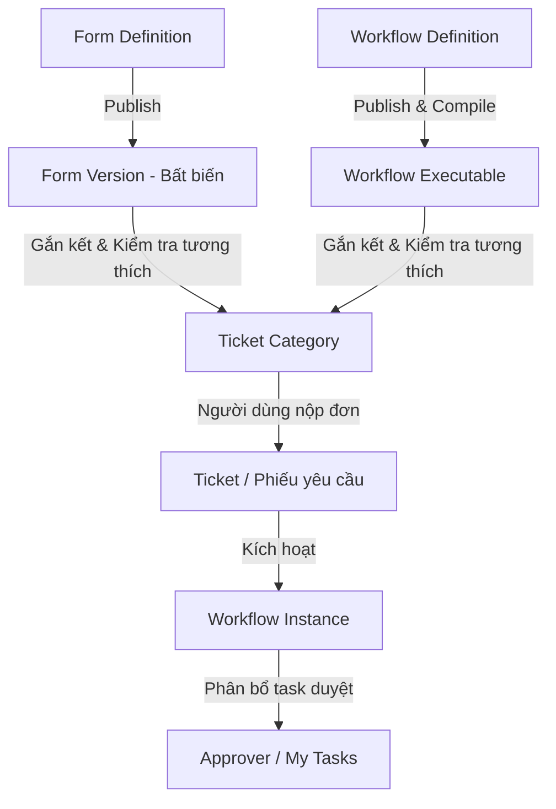

# Workflow Platform & Ticket Management (Decoupled Binding Architecture)

Hệ thống quản lý quy trình nghiệp vụ và xử lý phiếu yêu cầu (BPMN / Workflow Platform) được xây dựng theo mô hình phân rã (**Decoupled Binding Architecture**) giữa **Biểu mẫu (Form Engine)**, **Quy trình (Workflow Engine)** và **Danh mục dịch vụ (Ticket Category)**.

---

## 1. Kiến trúc Cốt lõi (Core Architecture)



- **Form độc lập**: Thiết kế biểu mẫu kéo thả linh hoạt, hỗ trợ đa dạng kiểu dữ liệu (Text, Number, Date, Select, File,...), đóng băng phiên bản thành snapshot bất biến (`FormVersion`).
- **Workflow độc lập**: Thiết kế luồng quy trình trực quan (Start $\rightarrow$ Condition $\rightarrow$ Approval $\rightarrow$ End) không phụ thuộc cứng vào bất kỳ form nào.
- **Ghép nối tại Ticket Category**: Là nơi duy nhất kết nối 1 `FormVersion` với 1 `WorkflowExecutable`. Hệ thống tự động thực hiện **Compatibility Validation** (đối soát trường dữ liệu cần cho điều kiện rẽ nhánh) trước khi lưu.
- **Phiếu yêu cầu (Ticket Portal & Approval Center)**:
  - Nhân viên truy cập Cổng yêu cầu, chọn danh mục, điền biểu mẫu động và nộp vé.
  - Người duyệt (`manager_of`, `role`, `fixed_user`) mở task duyệt trong **My Tasks** với trình render biểu mẫu chỉ đọc (**Readonly Dynamic Form**), lịch sử xét duyệt và thao tác Phê duyệt / Từ chối.

---

## 2. Hướng dẫn Khởi chạy Hệ thống

### Yêu cầu môi trường
- Docker Desktop
- Java 21, Maven 3.9+
- Node.js 22+

### Khởi động nhanh
```bash
# 1. Khởi chạy cơ sở dữ liệu MySQL & hạ tầng
docker compose up --build -d

# 2. Khởi chạy Frontend (Vite)
cd frontend
npm install
npm run dev

# 3. Khởi chạy Backend (Spring Boot)
cd ../backend
mvn spring-boot:run
```

- **Frontend:** `http://localhost:5173`
- **Backend API:** `http://localhost:8080/api/v1`
- **Health check:** `http://localhost:8080/actuator/health`

### Tài khoản mẫu kiểm thử (Seed Accounts)
| Vai trò | Tài khoản | Mật khẩu | Mô tả nhiệm vụ |
|---|---|---|---|
| **Quản trị viên** | `admin` | `admin123` | Quản lý Form, Workflow, Ticket Category, Cấu hình hệ thống |
| **Quản lý trực tiếp (Manager)** | `dung.ph` (`U004`) | `Welcome@123` | Trưởng phòng Công nghệ, thực hiện duyệt task cấp quản lý (`manager_of`) |
| **Nhân viên (Employee)** | `bach.th` (`U002`) | `Welcome@123` | Nhân viên nộp phiếu yêu cầu (`TCK-...`), theo dõi tiến trình xử lý |

---

## 3. Kiểm thử & Đóng gói (Build & Test)

```bash
# Kiểm thử toàn bộ Backend Unit & Integration Tests (H2 Mode & Flyway)
cd backend
mvn test

# Kiểm tra cú pháp và Build Frontend
cd ../frontend
npm run lint
npm run build
```

---

## 4. Cấu trúc Mã nguồn Dự án

```text
backend/
  src/main/java/com/acme/workflow/
    auth/          Xác thực, phân quyền theo Organization Scope
    category/      Ticket Category service, controller và compatibility validator
    common/        Tiện ích JSON, Ids, ApiException, AuditService
    directory/     Quản lý danh bạ người dùng, cơ cấu tổ chức HRM
    form/          Form Definition, Form Version snapshot và Form Service
    identity/      JPA Entities cho HRM User, Organization Unit, Role
    integration/   Connector, HTTP request integrations
    runtime/       Workflow Engine core, executors (Start, End, Approval, Condition...)
    ticket/        Ticket service, controller, submission validator và event listener
    workflow/      Workflow definition, compiler, DAG validator
  src/main/resources/
    db/migration/  Flyway migration scripts (V1 -> V8)
    db/seed/       Seed workflows và dữ liệu mẫu chuẩn

frontend/
  src/
    api/           Client HTTP API (tickets, forms, categories, tasks, runtime...)
    components/    Design system, DynamicFormRenderer, Modals, TaskApprovalModal
    pages/         TicketHub, CreateTicketPage, TicketDetail, MyTasks, FormBuilder,
                   WorkflowBuilder, CategoryList, InstancesList, UsersList...
    stores/        Zustand state stores (auth, designer, notification)
    types/         TypeScript interfaces cho ticket, form, category, workflow

doc/
  API_DOCUMENTATION.md                      Tài liệu REST API tổng hợp toàn bộ endpoints
  ticket_category/
    01_ARCHITECTURE_SPECIFICATION.md        Đặc tả kiến trúc phân rã (Decoupled Binding)
    02_PHASED_DEVELOPMENT_PLAN.md           Kế hoạch các giai đoạn phát triển (Phase 1 - 5)
```

Chi tiết các API xem tại [Tài liệu API](doc/API_DOCUMENTATION.md).
Chi tiết kiến trúc kỹ thuật xem tại [Đặc tả Kiến trúc](doc/ticket_category/01_ARCHITECTURE_SPECIFICATION.md).
