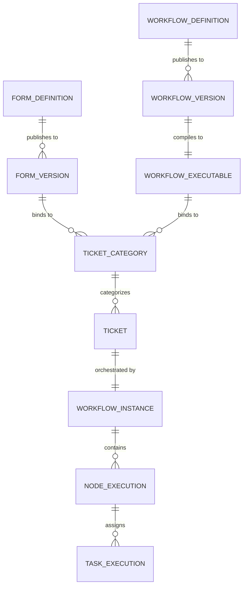
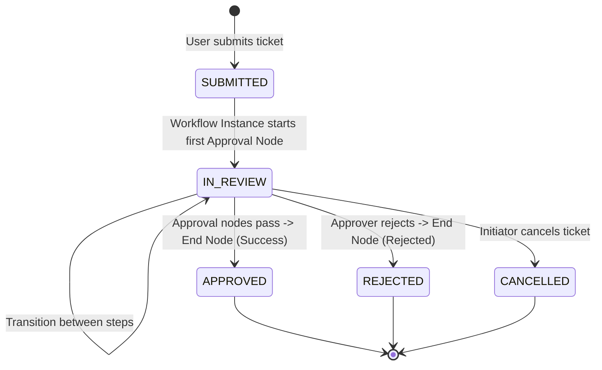

# Kiến trúc Hệ thống: Form – Workflow – Ticket Category (Decoupled Binding Architecture)

Tài liệu này đặc tả chi tiết kiến trúc kỹ thuật của hệ thống Workflow Platform theo mô hình phân rã (Decoupled Architecture) giữa **Form**, **Workflow Engine** và **Ticket Category**, giải quyết triệt để bài toán gắn kết động, đảm bảo tính toàn vẹn dữ liệu (Type Safety) và bất biến của phiên bản (Version Immutability).

---

## 1. Bối cảnh Nghiệp vụ & Nguyên tắc Thiết kế Cốt lõi

### 1.1. Phân định Vai trò (Actor Responsibilities)
1. **Quản trị viên (Admin):**
   - **Quản lý Form (Form Builder):** Thiết kế biểu mẫu độc lập, hỗ trợ đầy đủ các loại trường dữ liệu, validation rule, và publish các phiên bản bất biến (`FormVersion`).
   - **Quản lý Workflow (Workflow Designer):** Thiết kế luồng quy trình kéo thả độc lập (Start -> Condition -> Approval -> Task -> Service -> End) mà không bị phụ thuộc cứng vào bất kỳ Form nào tại thời điểm vẽ.
   - **Quản trị Danh mục Ticket (Ticket Category Management):** Là người chịu trách nhiệm kết nối 1 `FormVersion` cụ thể với 1 `WorkflowExecutable` cụ thể thành một Danh mục dịch vụ/yêu cầu khả dụng cho người dùng.
2. **Người dùng cuối / Nhân viên (User / Initiator):**
   - Không được phép tạo hoặc can thiệp vào định nghĩa Form/Workflow.
   - Truy cập danh mục dịch vụ (Ticket Category), điền thông tin biểu mẫu được kết xuất động, và gửi yêu cầu (Submit Ticket).
   - Theo dõi trạng thái vé (`Ticket Status`), bước thực thi hiện tại (`Current Step`), và lịch sử phê duyệt.
3. **Người phê duyệt / Xử lý task (Approver / Assignee):**
   - Nhận task được phân bổ từ Workflow Engine.
   - Xem dữ liệu biểu mẫu đã gửi dưới chế độ xem (Read-only Dynamic Form View).
   - Thực hiện hành động: Phê duyệt (Approve), Từ chối (Reject), hoặc Yêu cầu bổ sung thông tin (Request Revision).

---

### 1.2. Nguyên tắc Thiết kế Bất biến (Core Architectural Principles)
1. **Decoupling (Phân rã hoàn toàn giữa Form & Workflow):**
   - Workflow không chứa ID của Form. Form không chứa ID của Workflow.
   - Một Workflow (ví dụ: *"Quy trình duyệt ngân sách 2 cấp"*) có thể được tái sử dụng cho nhiều Form khác nhau (Form mua sắm thiết bị, Form tạm ứng công tác, Form chi phí tiếp khách).
2. **Binding at Category (Gắn kết duy nhất tại Ticket Category):**
   - Cặp ghép giữa Form và Workflow chỉ xảy ra và được ghi nhận tại thực thể `TicketCategory`.
3. **Version Immutability (Bất biến theo Snapshot):**
   - `TicketCategory` không trỏ tới Form sống (draft) hay Workflow sống, mà trỏ tới `form_version_id` và `workflow_executable_id`.
   - Mọi thay đổi ở Form hay Workflow sau đó đều tạo ra phiên bản mới và không làm ảnh hưởng tới các Category đang hoạt động cũng như các Ticket/Instance đang chạy.
4. **Contract-Based Validation (Kiểm tra tương thích trước khi kích hoạt):**
   - Trước khi lưu một Ticket Category, hệ thống bắt buộc thực hiện kiểm tra đối soát (Compatibility Validation) giữa các trường dữ liệu mà Workflow đòi hỏi (Input Contract / Condition rules) với các trường mà Form cung cấp.
5. **Single-Direction Flow (Dòng chảy một chiều):**
   - `Ticket` là thực thể tiếp nhận và lưu trữ `formData` ban đầu.
   - `WorkflowInstance` tiếp nhận `formData` thông qua Runtime Context để điều hướng và xử lý logic, không sửa đổi dữ liệu gốc của Ticket trừ khi có bước cập nhật được chỉ định rõ.

---

## 2. Mô hình Thực thể Dữ liệu (Domain Entity Model)

### 2.1. Sơ đồ Quan hệ Thực thể (ERD)



---

### 2.2. Chi tiết Cấu trúc Bảng & Trường Dữ liệu

#### 1. Form Engine
* **`form_definition`**: Lưu trữ metadata và trạng thái soạn thảo (Draft).
  * `id` (UUID, PK)
  * `name` (VARCHAR): Tên biểu mẫu (VD: Biểu mẫu xin đi công tác).
  * `code` (VARCHAR, UNIQUE): Mã định danh (VD: `FORM_TRIP_REQUEST`).
  * `description` (TEXT)
  * `draft_schema` (JSONB): Cấu hình các trường form đang thiết kế.
  * `status` (VARCHAR): `DRAFT`, `PUBLISHED`, `ARCHIVED`.
  * `created_by`, `created_at`, `updated_at`.

* **`form_version`**: Snapshot bất biến của Form khi được Publish.
  * `id` (UUID, PK)
  * `form_definition_id` (UUID, FK -> `form_definition.id`)
  * `version_number` (INT): Số phiên bản tăng tự tiến (v1, v2, v3).
  * `schema_snapshot` (JSONB): Toàn bộ danh sách trường, validation, layout tại thời điểm publish.
  * `published_by` (VARCHAR), `published_at` (TIMESTAMP).

#### 2. Workflow Core
* Kế thừa cấu trúc hiện tại:
  * `workflow_definition`: Chứa bản thiết kế Workflow.
  * `workflow_version`: Bản đóng băng phiên bản.
  * `workflow_executable`: Bản JSON thực thi đã qua bước compile/validate DAG, sẵn sàng nạp vào Runtime Engine.

#### 3. Ticket Category (Cầu nối liên kết)
* **`ticket_category`**:
  * `id` (UUID, PK)
  * `name` (VARCHAR): Tên hiển thị với người dùng (VD: Đăng ký Đi Công Tác).
  * `code` (VARCHAR, UNIQUE): Mã danh mục (VD: `CAT_BUSINESS_TRIP`).
  * `description` (TEXT)
  * `icon` (VARCHAR), `color` (VARCHAR): Dùng hiển thị Portal.
  * `form_version_id` (UUID, FK -> `form_version.id`): Phiên bản Form được ghim.
  * `workflow_executable_id` (UUID, FK -> `workflow_executable.id`): Phiên bản Workflow được ghim.
  * `field_mapping` (JSONB): Bảng map giữa tên biến trong Workflow và trường của Form (nếu khác nhau).
  * `is_active` (BOOLEAN): Trạng thái kích hoạt.
  * `created_at`, `updated_at`.

#### 4. Ticket & Runtime Instance
* **`ticket`**:
  * `id` (UUID, PK)
  * `ticket_code` (VARCHAR, UNIQUE): Mã định danh người dùng nhìn thấy (VD: `TCK-20260911-0001`).
  * `category_id` (UUID, FK -> `ticket_category.id`)
  * `form_version_id` (UUID, FK -> `form_version.id`): Ghim lại phiên bản Form đã nộp.
  * `workflow_instance_id` (UUID, FK -> `workflow_instance.id`): Liên kết 1-1 với instance điều phối.
  * `initiator_id` (VARCHAR): ID nhân viên tạo đơn.
  * `initiator_department_id` (VARCHAR): Phòng ban người tạo.
  * `form_data` (JSONB): Dữ liệu nhập thực tế của người dùng.
  * `status` (VARCHAR): Trạng thái nghiệp vụ của Ticket (`DRAFT`, `SUBMITTED`, `IN_REVIEW`, `APPROVED`, `REJECTED`, `CANCELLED`).
  * `current_step_name` (VARCHAR): Tên bước hiện tại đang dừng.
  * `created_at`, `updated_at`, `resolved_at`.

---

## 3. Kiến trúc Giải pháp Kỹ thuật

### 3.1. Thiết kế Form Schema Chuẩn hóa (Form Engine Specification)
Schema của `FormVersion` được định nghĩa theo cấu trúc JSON có kiểm soát kiểu dữ liệu nghiêm ngặt:

```json
{
  "fields": [
    {
      "key": "trip_cost",
      "label": "Dự toán chi phí",
      "type": "number",
      "required": true,
      "validation": {
        "min": 0,
        "max": 100000000
      },
      "defaultValue": 0
    },
    {
      "key": "destination",
      "label": "Địa điểm công tác",
      "type": "string",
      "required": true,
      "validation": {
        "maxLength": 200
      }
    },
    {
      "key": "transport_type",
      "label": "Phương tiện di chuyển",
      "type": "select",
      "options": [
        { "label": "Máy bay", "value": "PLANE" },
        { "label": "Tàu hỏa", "value": "TRAIN" },
        { "label": "Xe khách/Ô tô", "value": "CAR" }
      ],
      "required": true
    },
    {
      "key": "is_urgent",
      "label": "Yêu cầu khẩn cấp",
      "type": "boolean",
      "defaultValue": false
    }
  ]
}
```

**Các kiểu dữ liệu hỗ trợ (`type`):**
- `string`: Ký tự văn bản ngắn.
- `textarea`: Văn bản dài / ghi chú.
- `number`: Số nguyên / số thực.
- `boolean`: Checkbox / Công tắc đúng sai.
- `date`: Ngày tháng (`YYYY-MM-DD`).
- `datetime`: Ngày giờ ISO 8601.
- `select`: Dropdown chọn 1 giá trị.
- `multiselect`: Dropdown chọn nhiều giá trị.
- `file`: Đính kèm file (lưu trữ metadata file/URL).

---

### 3.2. Thiết kế Condition Node & Structured Rules (Workflow Core)

Để loại bỏ hoàn toàn việc phụ thuộc vào mã script hoặc expression runtime không kiểm soát, mọi Condition Node trong Workflow Designer lưu trữ dưới dạng **Abstract Syntax Tree (AST) Rules JSON**:

```json
{
  "nodeId": "node_check_budget",
  "nodeType": "CONDITION",
  "name": "Kiểm tra mức chi phí",
  "config": {
    "logic": "AND",
    "rules": [
      {
        "field": "trip_cost",
        "fieldType": "number",
        "operator": "GREATER_THAN",
        "value": 10000000
      },
      {
        "field": "transport_type",
        "fieldType": "string",
        "operator": "EQUALS",
        "value": "PLANE"
      }
    ],
    "trueTransitionNodeId": "node_approve_director",
    "falseTransitionNodeId": "node_approve_manager"
  }
}
```

#### Ma trận Toán tử (Operator Matrix theo Field Type)
| Kiểu dữ liệu (`fieldType`) | Các toán tử hợp lệ (`operator`) |
|---|---|
| `number` | `EQUALS`, `NOT_EQUALS`, `GREATER_THAN`, `LESS_THAN`, `GREATER_THAN_OR_EQUAL`, `LESS_THAN_OR_EQUAL`, `BETWEEN` |
| `string` / `textarea` | `EQUALS`, `NOT_EQUALS`, `CONTAINS`, `STARTS_WITH`, `IS_EMPTY`, `IS_NOT_EMPTY` |
| `boolean` | `IS_TRUE`, `IS_FALSE` |
| `date` / `datetime` | `BEFORE`, `AFTER`, `EQUALS`, `BETWEEN` |
| `select` | `EQUALS`, `NOT_EQUALS`, `IN`, `NOT_IN` |
| `multiselect` | `CONTAINS_ANY`, `CONTAINS_ALL`, `IS_EMPTY` |

---

### 3.3. Cơ chế Design-Time Hint và Field Mapping

1. **Khi vẽ Workflow (Design-time):**
   - Admin có thể bật tùy chọn *"Preview với Form"*: Cho phép chọn tạm 1 Form để lấy danh sách trường hiển thị vào dropdown khi soạn thảo Condition Node, giúp chọn nhanh tên trường và kiểu dữ liệu tương ứng.
   - Nếu không chọn Preview Form, Admin tự gõ `field` và chọn `fieldType`.
   - Workflow độc lập không lưu liên kết với Form Preview này.

2. **Cơ chế Field Mapping tại Ticket Category:**
   - Để tránh trường hợp Form đặt tên trường là `chi_phi` còn Workflow Condition lại kiểm tra `trip_cost`, hệ thống cung cấp bảng **Field Mapping** trong modal tạo Ticket Category:
     - Tự động ghép nối (Auto-match) nếu tên trường và kiểu dữ liệu trùng nhau.
     - Cho phép Admin map thủ công: `trip_cost` (Workflow) <= `chi_phi` (Form).
   - Khi Workflow Instance chạy, Engine sẽ tự động chuyển đổi key dữ liệu theo bảng map này trước khi đánh giá Condition.

---

### 3.4. Động cơ Đối soát Tương thích (Compatibility Validation Engine)

Khi Admin ấn **Save** (hoặc ấn nút *"Kiểm tra tương thích"*) tại màn hình Ticket Category, Backend thực thi thuật toán kiểm tra:

```
Input: FormVersion.schemaSnapshot, WorkflowExecutable.nodes, FieldMapping (optional)

Bước 1: Trích xuất toàn bộ trường Workflow yêu cầu:
   - Duyệt qua tất cả các Condition Nodes -> thu thập danh sách { field, fieldType }.
   - Duyệt qua các Task/Approval/Service Nodes (nếu có tham chiếu biến).
   - Áp dụng FieldMapping (nếu có) để tìm tên trường gốc tương ứng ở Form.

Bước 2: Đối chiếu với FormVersion.schemaSnapshot:
   Với mỗi trường yêu cầu:
   - Kiểm tra trường có tồn tại trong Form schema không?
     -> Nếu không: Báo lỗi MISSING_FIELD (kèm tên Node đang dùng).
   - Kiểm tra kiểu dữ liệu có tương thích không (VD: Form là string mà Workflow lại so sánh number)?
     -> Nếu không: Báo lỗi TYPE_MISMATCH (kèm thông tin chi tiết).

Bước 3: Tổng hợp kết quả:
   - Nếu danh sách lỗi rỗng -> Trả về HTTP 200 OK (VALID).
   - Nếu có lỗi -> Trả về HTTP 422 Unprocessable Entity với danh sách lỗi chi tiết, chặn lưu Category.
```

**Ví dụ phản hồi lỗi đối soát:**
```json
{
  "valid": false,
  "errors": [
    {
      "nodeId": "node_check_budget",
      "nodeName": "Kiểm tra mức chi phí",
      "requiredField": "trip_cost",
      "expectedType": "number",
      "errorCode": "MISSING_FIELD",
      "message": "Node 'Kiểm tra mức chi phí' yêu cầu trường 'trip_cost' (number) nhưng Form 'Trip Request v1' không có trường này."
    }
  ]
}
```

---

### 3.5. Dữ liệu Runtime Context & Cấu trúc Khởi tạo Instance

Khi User submit đơn tạo Ticket, Backend tiến hành:
1. Validate toàn bộ `formData` theo `form_version.schema_snapshot`.
2. Tạo bản ghi `ticket` (trạng thái `SUBMITTED`).
3. Khởi tạo `workflow_instance` với payload chuẩn:

```json
{
  "instanceId": "inst_98234-a1",
  "workflowExecutableId": "wf_exec_trip_v2",
  "context": {
    "ticketId": "tck_20260911_0012",
    "ticketCode": "TCK-20260911-0012",
    "categoryId": "cat_business_trip",
    "formVersionId": "fv_trip_req_v1",
    "initiator": {
      "userId": "usr_phandinhphu",
      "displayName": "Phan Đình Phú",
      "departmentId": "dept_software_eng",
      "managerId": "usr_director_01"
    },
    "formData": {
      "trip_cost": 15000000,
      "destination": "Đà Nẵng",
      "transport_type": "PLANE",
      "is_urgent": true
    },
    "metadata": {
      "submittedAt": "2026-09-11T21:10:00Z"
    }
  }
}
```

- **Đánh giá Condition:** Condition Node chỉ việc đọc trực tiếp `context.formData.<field>` để so sánh theo toán tử đã định nghĩa.
- **Phân bổ Người duyệt (Resolver Node):**
  - `MANAGER_OF`: Đọc `context.initiator.userId` -> tra cứu trực tiếp hoặc đọc từ context ra `managerId`.
  - `ROLE`: Gán task cho nhóm có thẩm quyền (VD: `FINANCE_APPROVER`).
  - `INITIATOR`: Gán lại task cho chính người tạo (nếu quy trình yêu cầu chỉnh sửa/bổ sung).

---

### 3.6. Đồng bộ Trạng thái 2 Chiều: Ticket State vs Workflow State Machine

`Ticket` và `WorkflowInstance` có mối quan hệ 1-1 chặt chẽ về mặt trạng thái:



- Khi Workflow Engine chuyển trạng thái của Node Execution (ví dụ từ `node_manager_approval` sang `node_director_approval`), Engine tự động trigger event / hook để cập nhật:
  - `ticket.current_step_name` = Tên hiển thị của node mới (VD: *"Giám đốc phê duyệt"*).
  - `ticket.updated_at` = Thời gian hiện tại.
- Khi Workflow kết thúc:
  - Nếu kết thúc tại Node thành công -> `ticket.status = 'APPROVED'`, `ticket.resolved_at = NOW()`.
  - Nếu kết thúc do từ chối -> `ticket.status = 'REJECTED'`, `ticket.resolved_at = NOW()`.

---

### 3.7. Trải nghiệm Giao diện Người duyệt (Approval Task UI)

Khi một Task được gán cho Approver:
1. Approver truy cập màn hình **My Tasks** -> Click vào task liên quan.
2. Giao diện nạp component **DynamicFormRenderer** ở chế độ **Read-only**:
   - Sử dụng đúng `formVersion.schemaSnapshot` đã nộp.
   - Render hiển thị lại toàn bộ giá trị đã điền trong `ticket.formData`.
3. Hiển thị thông tin người nộp (Initiator Avatar, Họ tên, Phòng ban, Ngày nộp).
4. Hiển thị Timeline tiến trình duyệt (Ai đã duyệt trước đó, ghi chú là gì).
5. Khung nhập lý do/ghi chú và các nút hành động nghiệp vụ:
   - **Approve (Phê duyệt)**
   - **Reject (Từ chối)**
   - **Request Revision (Yêu cầu chỉnh sửa lại)**

---

## 4. Quản trị Vòng đời & Versioning Governance

1. **Khi Form được chỉnh sửa:**
   - Form chỉ được chỉnh sửa trên bản nháp (`DRAFT`).
   - Khi Admin bấm `Publish`, hệ thống sinh ra `FormVersion` số nguyên kế tiếp (ví dụ v2).
   - Các `TicketCategory` hiện tại vẫn tiếp tục sử dụng `FormVersion` cũ (v1), đảm bảo hệ thống không bị gián đoạn hay phát sinh lỗi tương thích ngoài ý muốn.
2. **Cảnh báo Version Mới trên Ticket Category (Impact Alert):**
   - Nếu một Category đang gắn với FormVersion cũ mà Form gốc đã có phiên bản mới hơn, màn hình Ticket Category hiển thị huy hiệu thông báo: *"Có Form version mới khả dụng (v2)"*.
   - Admin có quyền bấm nút *"Cập nhật phiên bản"*:
     - Hệ thống tự động kích hoạt chạy lại **Compatibility Validation**.
     - Nếu pass -> Cho phép cập nhật Category lên v2.
     - Nếu fail -> Liệt kê danh sách trường bị xung đột để Admin điều chỉnh trước khi xác nhận.
3. **Khi Ticket đang chạy mà có Category/Form mới:**
   - `Ticket` và `WorkflowInstance` lưu trực tiếp `form_version_id` và `workflow_executable_id` trong dữ liệu của chính mình.
   - Do đó, dù Category có được nâng cấp lên version mới, mọi ticket cũ vẫn vận hành 100% chính xác theo schema snapshot tại thời điểm nó được sinh ra.

---

## 5. Danh mục APIs Cốt lõi của Kiến trúc Mới

| Phương thức | Endpoint | Mô tả |
|---|---|---|
| `POST` | `/api/forms` | Tạo mới Form định nghĩa (Draft) |
| `PUT` | `/api/forms/{id}` | Cập nhật draft schema của Form |
| `POST` | `/api/forms/{id}/publish` | Publish Form -> sinh `FormVersion` mới |
| `GET` | `/api/forms/{id}/versions` | Lấy danh sách các phiên bản đã publish của Form |
| `POST` | `/api/ticket-categories/validate-mapping` | Kiểm tra tương thích giữa `formVersionId` và `workflowExecutableId` |
| `POST` | `/api/ticket-categories` | Tạo Ticket Category (sau khi đã validate tương thích) |
| `GET` | `/api/ticket-categories` | Danh sách Category khả dụng (Portal User & Admin) |
| `GET` | `/api/ticket-categories/{id}/form-schema` | Tải schema FormVersion gắn với Category để render động |
| `POST` | `/api/tickets` | Tạo mới Ticket + kích hoạt Workflow Instance |
| `GET` | `/api/tickets/my-tickets` | Danh sách Ticket của người dùng đang đăng nhập |
| `GET` | `/api/tickets/{id}` | Chi tiết Ticket (formData, state, timeline node) |
| `POST` | `/api/tasks/{taskId}/action` | Thực hiện Approve/Reject task kèm comment |
