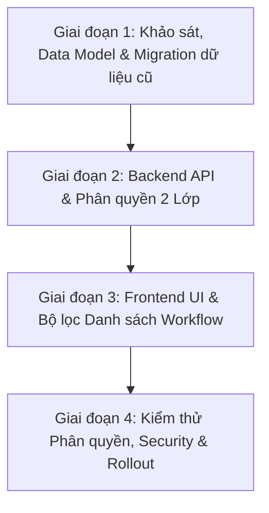

# Kế hoạch phát triển chi tiết: Module áp dụng (Workflow Module)

## 1. Tổng quan và Mục tiêu

Tài liệu này chi tiết hoá lộ trình phát triển cho tính năng **Module áp dụng (Applicable Module)** từ tài liệu tổng thể [Ke_hoach_ung_dung_Workflow_Type_va_Module.md](file:///d:/workspace/fpt/workflow_builder_poc/doc/workflow_type_and_module/Ke_hoach_ung_dung_Workflow_Type_va_Module.md).

### Mục tiêu chính
1. **Chuẩn hoá danh mục Module**: Chuyển đổi dữ liệu `applicableModule` từ dạng chuỗi tự do (free text) sang danh mục thực thể chuẩn trong cơ sở dữ liệu (`module`), liên kết phù hợp với đơn vị/phòng ban nghiệp vụ (IT, HR, Purchase, Finance...).
2. **Cơ chế phân quyền 2 lớp (Two-tier Access Control)**:
   - **Lớp 1 (Phân quyền thô - Coarse-grained)**: Phân quyền theo Module/Phòng ban — người dùng chỉ nhìn thấy và thao tác trên các workflow thuộc module mà họ được cấp quyền.
   - **Lớp 2 (Phân quyền chi tiết - Fine-grained)**: Cơ chế ACL theo từng workflow cụ thể (Owner, Editor, Viewer) đã có sẵn trong hệ thống.
3. **Chuẩn hoá giao diện quản trị**: Bổ sung bộ lọc danh sách workflow theo Module và Dropdown chọn Module chuẩn hoá khi tạo mới/cấu hình workflow.

### Phạm vi KHÔNG thực hiện (Out of Scope)
- **Không** dùng Module của Workflow để gợi ý liên kết Form–Workflow tại Ticket Category (do Form hiện chưa có thuộc tính Module).
- **Không** tự động suy luận hoặc đồng bộ Module sang cho Form ở giai đoạn này.

---

## 2. Kế hoạch phát triển theo từng giai đoạn

---

### Giai đoạn 1: Khảo sát Identity, Thiết kế Data Model & Migration Dữ liệu (Prerequisites & Data Migration)

#### 1.1. Mục tiêu giai đoạn
- Làm rõ cấu trúc liên kết giữa User, Department và Module trong hệ thống Identity.
- Thiết kế cơ sở dữ liệu và chuyển đổi dữ liệu free-text hiện có sang danh mục chuẩn.

#### 1.2. Công việc chi tiết
1. **Khảo sát & Làm rõ các câu hỏi chặn (Prerequisites Check)**:
   - Rà soát bảng `users`, `departments` (nếu có) trong hệ thống hiện tại.
   - Xác định quan hệ: Module là ánh xạ 1-1 với Department hay 1 Department có thể có nhiều Module (hoặc Module là danh mục độc lập có gắn `department_id`).
2. **Thiết kế Schema Database**:
   - Bảng `module`:
     - `id` (PK): Mã định danh module (ví dụ: `MOD_IT`, `MOD_HR`, `MOD_PURCHASE`, `MOD_FINANCE`).
     - `name`: Tên module (ví dụ: "Công nghệ thông tin", "Nhân sự", "Mua sắm", "Tài chính").
     - `description`: Mô tả phạm vi nghiệp vụ của module.
     - `department_id` (FK, Nullable): Khóa ngoại liên kết tới phòng ban tương ứng (nếu có bảng `department`).
     - `is_active`: Trạng thái hoạt động.
   - Bảng `user_module_access` (hoặc `role_module_access`):
     - `id` (PK)
     - `user_id` (FK -> `users.id`)
     - `module_id` (FK -> `module.id`)
     - `access_level`: Mức quyền trên module (`VIEWER`, `EDITOR`, `MANAGER`).
   - Cập nhật bảng `workflow`:
     - Thay thế cột `applicable_module` (text) bằng `module_id` (FK -> `module.id`).
3. **Chuẩn hoá & Migration Dữ liệu Free-Text cũ**:
   - Viết script phân tích toàn bộ dữ liệu string trong cột `applicable_module` hiện có của các workflow.
   - Gom nhóm các giá trị tương đương hoặc viết hoa/thường khác nhau (ví dụ: `"IT"`, `"it"`, `"Phòng IT"`, `"CNTT"` -> gom thành `MOD_IT`).
   - Tạo danh mục Module chuẩn và cập nhật `module_id` tương ứng cho từng workflow.
   - Các workflow có module để trống hoặc không xác định: gán về một module chung mặc định (ví dụ: `MOD_GENERAL` - Module Chung).
4. **Khởi tạo quyền truy cập ban đầu**:
   - Cấp toàn quyền truy cập tất cả Module cho các tài khoản có Role `ADMIN` / `SUPER_ADMIN`.
   - Cấp quyền truy cập Module tương ứng cho các user quản lý nghiệp vụ hiện hữu.

#### 1.3. Tiêu chí hoàn thành (DoD)
- [x] Schema database mới được áp dụng hoàn tất.
- [x] 100% bản ghi workflow cũ được chuyển đổi thành công từ text sang `module_id` hợp lệ.
- [x] Script migration chạy an toàn, có khả năng rollback nếu có sự cố.

---

### Giai đoạn 2: Phát triển Backend API & Tích hợp Phân quyền 2 Lớp (Backend & Security Layer)

#### 2.1. Mục tiêu giai đoạn
- Xây dựng API quản lý danh mục Module.
- Tích hợp lớp kiểm tra phân quyền Module vào toàn bộ các API truy vấn và thao tác trên Workflow.

#### 2.2. Công việc chi tiết
1. **Xây dựng API Quản lý Module**:
   - `GET /api/modules`: Lấy danh sách các module đang hoạt động.
   - `GET /api/users/me/modules`: Lấy danh sách các module mà user hiện tại được cấp quyền truy cập.
   - `GET /api/modules/{id}`: Xem chi tiết thông tin module.
2. **Cơ chế Phân quyền 2 Lớp tại Workflow API**:
   - **Lớp 1 - Lọc theo Module (Module Scope Filter)**:
     - Áp dụng Query Interceptor / Filter Middleware trên API `GET /api/workflows`:
       - Nếu user có vai trò `ADMIN`: Bỏ qua bộ lọc module, trả về danh sách đầy đủ.
       - Nếu là User thông thường: Tự động bổ sung điều kiện lọc `workflow.module_id IN (danh sách module user có quyền)`.
   - **Lớp 2 - Áp dụng ACL Workflow (Fine-grained ACL)**:
     - Trên tập kết quả đã được lọc theo Module, tiếp tục áp dụng quyền chi tiết (Owner / Editor / Viewer) của từng workflow như hệ thống hiện hành.
3. **Kiểm tra quyền khi Tạo / Chỉnh sửa / Xoá Workflow**:
   - **Tạo mới (`POST /api/workflows`)**: Kiểm tra user có quyền `EDITOR` hoặc `MANAGER` trên `module_id` được chọn hay không. Chặn nếu cố tình gán vào module mình không có quyền.
   - **Cập nhật / Lưu Designer (`PUT /api/workflows/{id}`)**: Xác thực user vừa thuộc Module của workflow, vừa có quyền Edit trên ACL của workflow đó.
   - **Xoá Workflow (`DELETE /api/workflows/{id}`)**: Chỉ cho phép khi có quyền xóa theo cả 2 lớp.

#### 2.3. Tiêu chí hoàn thành (DoD)
- [ ] User chỉ thấy các workflow thuộc Module mình được phân quyền khi gọi API danh sách.
- [ ] User không thể truy cập trái phép workflow của Module khác thông qua việc truyền thẳng Workflow ID vào API chi tiết.
- [ ] Admin có toàn quyền xem và quản trị workflow trên mọi Module.

---

### Giai đoạn 3: Cập nhật Giao diện Quản trị & Trải nghiệm Người dùng (Frontend UI/UX)

#### 3.1. Mục tiêu giai đoạn
- Đồng bộ hóa các dropdown chọn Module trên toàn bộ giao diện.
- Bổ sung bộ lọc Module trực quan tại màn hình Danh sách Workflow.

#### 3.2. Công việc chi tiết
1. **Màn hình Danh sách Workflow (Workflow Management List)**:
   - Thêm dropdown **Bộ lọc theo Module (Module Filter)** ở thanh công cụ phía trên:
     - Danh sách dropdown chỉ hiển thị các Module mà user đang có quyền xem (hoặc tất cả nếu là Admin).
     - Hỗ trợ lựa chọn: "Tất cả Module", hoặc chọn một Module cụ thể.
   - Cột "Module áp dụng" trong bảng: Hiển thị dạng Badge có màu sắc nhận diện rõ ràng cho từng phòng ban/đơn vị.
   - Đồng bộ state của bộ lọc Module với URL Query Params (ví dụ: `?module=MOD_IT`) để hỗ trợ bookmark và reload trang.
2. **Màn hình Tạo mới & Cấu hình Thông tin Workflow (Workflow Settings)**:
   - Thay thế toàn bộ ô nhập văn bản (Text Input) cũ bằng Dropdown chọn Module chuẩn hoá:
     - Fetch danh sách từ API `/api/users/me/modules` (chỉ hiển thị những module user được phép tạo workflow).
     - Có hiển thị mô tả ngắn hoặc badge phòng ban kèm theo tên module.
     - Bắt buộc chọn (Required field), không cho phép để trống.
3. **Xử lý UX khi Không có Quyền Truy cập**:
   - Hiển thị màn hình thông báo thân thiện (403 Forbidden / Empty State) khi người dùng cố truy cập workflow thuộc Module mà mình không có quyền thông qua đường dẫn trực tiếp.

#### 3.3. Tiêu chí hoàn thành (DoD)
- [ ] Không còn ô nhập free-text cho trường Module trên toàn bộ ứng dụng Frontend.
- [ ] Bộ lọc Module hoạt động mượt mà, phân trang và tìm kiếm kết hợp chính xác với bộ lọc Module.
- [ ] Giao diện trực quan, rõ ràng, hiển thị badge module chuẩn theo thiết kế.

---

### Giai đoạn 4: Kiểm thử Toàn diện, Security Matrix & Triển khai (Testing & Rollout)

#### 4.1. Mục tiêu giai đoạn
- Đảm bảo tính bảo mật, ngăn chặn rò rỉ dữ liệu giữa các phòng ban.
- Hoàn thiện tài liệu hướng dẫn vận hành phân quyền.

#### 4.2. Công việc chi tiết
1. **Kiểm thử Ma trận Phân quyền (Security & Access Matrix Testing)**:
   - Thiết lập các nhóm user thử nghiệm:
     - User IT: Chỉ có quyền trên `MOD_IT`.
     - User HR: Chỉ có quyền trên `MOD_HR`.
     - User Multi-module: Có quyền trên cả `MOD_IT` và `MOD_PURCHASE`.
     - Admin: Toàn quyền.
   - Thực hiện kiểm thử chéo:
     - User HR cố gắng GET/PUT/DELETE workflow của IT qua API/URL -> Phải nhận mã lỗi `403 Forbidden` hoặc `404 Not Found`.
     - User IT tạo workflow và cố tình truyền `moduleId: "MOD_HR"` trong payload -> Phải bị chặn tại Backend.
2. **Kiểm thử Hồi quy & Tải (Regression & Performance Testing)**:
   - Đảm bảo việc thêm điều kiện lọc Module trong câu query không làm suy giảm hiệu năng khi số lượng workflow tăng lên.
   - Đánh index cho cột `module_id` trên bảng `workflow` và `(user_id, module_id)` trên bảng `user_module_access`.
3. **Tài liệu hoá Vận hành**:
   - Tài liệu hướng dẫn System Admin cách thêm mới Module và gán quyền Module cho User/Department.

#### 4.3. Tiêu chí hoàn thành (DoD)
- [ ] 100% test cases trong Ma trận phân quyền đạt kết quả Passed.
- [ ] Không có lỗ hổng rò rỉ dữ liệu IDOR (Insecure Direct Object Reference) qua API Workflow.
- [ ] Bộ chỉ mục (Index) database được thiết lập tối ưu.

---

## 3. Ma trận Phân công và Ước lượng

| Giai đoạn | Nhiệm vụ chính | Trách nhiệm | Ước lượng |
|---|---|---|---|
| **Giai đoạn 1** | Khảo sát Identity, Schema DB Module & Data Migration Script | Backend / DBA | 2 ngày |
| **Giai đoạn 2** | Backend Module API & Middleware phân quyền 2 lớp | Backend | 2.5 - 3 ngày |
| **Giai đoạn 3** | UI Dropdown chuẩn hoá, Bộ lọc Module & Badge danh sách | Frontend | 2 - 2.5 ngày |
| **Giai đoạn 4** | Security Matrix Testing, Indexing & Rollout | Fullstack / QA | 1.5 - 2 ngày |

---

## 4. Quản trị Rủi ro (Risk Management)

| Rủi ro | Mức độ | Biện pháp giảm thiểu |
|---|---|---|
| Rò rỉ dữ liệu workflow giữa các phòng ban qua API trực tiếp | Cao | Bắt buộc kiểm tra phân quyền Module ở tầng Backend (Service/Middleware), không phụ thuộc vào bộ lọc ở Frontend. |
| Dữ liệu Module free-text cũ bị phân mảnh, sai chính tả | Trung bình | Xây dựng script phân tích tiền migration, chuẩn hoá mapping theo từ khoá và đưa về `MOD_GENERAL` cho các case không xác định. |
| User bị mất quyền truy cập vào workflow cũ sau khi bật phân quyền | Trung bình | Tự động gán quyền Module tương ứng cho Owner của các workflow hiện hữu trong quá trình chạy script migration. |
