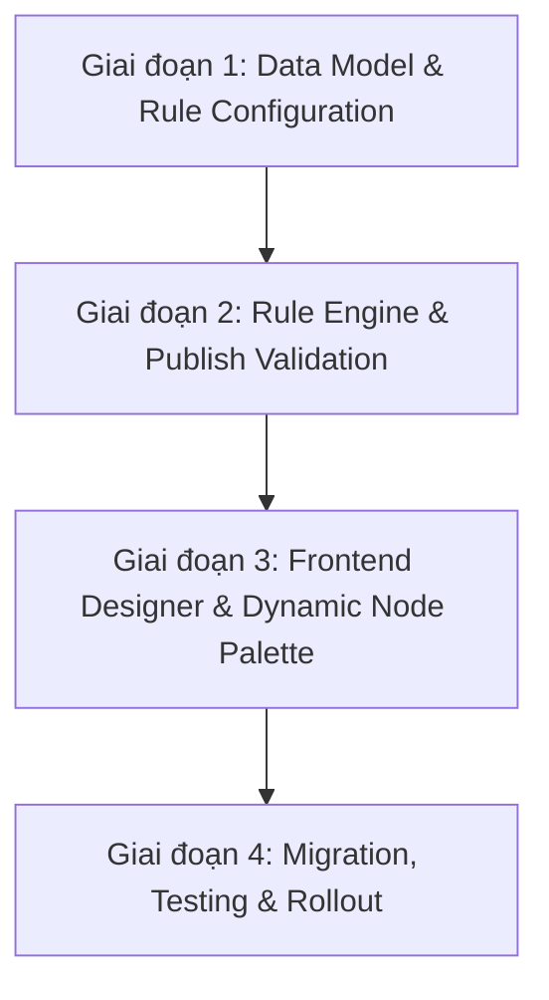

# Kế hoạch phát triển chi tiết: Loại Workflow (Workflow Type)

## 1. Tổng quan và Mục tiêu

Tài liệu này chi tiết hoá lộ trình phát triển cho tính năng **Loại Workflow (Workflow Type)** từ tài liệu tổng thể [Ke_hoach_ung_dung_Workflow_Type_va_Module.md](file:///d:/workspace/fpt/workflow_builder_poc/doc/workflow_type_and_module/Ke_hoach_ung_dung_Workflow_Type_va_Module.md).

### Mục tiêu chính
1. **Chuẩn hoá dữ liệu**: Chuyển đổi thuộc tính `workflowType` từ metadata tĩnh thành danh mục chuẩn có cấu hình linh hoạt trong cơ sở dữ liệu (`workflow_type`).
2. **Publish Validation Rule Engine**: Xây dựng bộ quy tắc kiểm tra logic workflow theo từng loại khi người dùng thực hiện Publish (bắt buộc/cấm các loại node đặc thù).
3. **Dynamic Node Palette**: Giới hạn và tuỳ biến danh sách Node trên Palette của Designer canvas dựa theo loại workflow được chọn, hỗ trợ loại `CUSTOM` như một escape hatch an toàn.
4. **Trải nghiệm thiết kế an toàn**: Cung cấp cơ chế cảnh báo thông minh khi đổi loại workflow mà không xoá mất dữ liệu của người dùng.

---

## 2. Kế hoạch phát triển theo từng giai đoạn

---

### Giai đoạn 1: Thiết kế Cơ sở dữ liệu & Cấu hình Danh mục (Database & API Foundation)

#### 1.1. Mục tiêu giai đoạn
- Thiết lập các bảng quản lý danh mục Loại Workflow, Rule kiểm tra, và Danh sách Node cho phép.
- Cung cấp các API nền tảng để Frontend và Backend tái sử dụng linh hoạt mà không cần hard-code enum.

#### 1.2. Công việc chi tiết
1. **Thiết kế Schema Database**:
   - Bảng `workflow_type`:
     - `id` (PK): Mã định danh (ví dụ: `APPROVAL`, `NOTIFICATION`, `AUTOMATION`, `REVIEW`, `CUSTOM`).
     - `name`: Tên hiển thị (ví dụ: "Quy trình phê duyệt", "Quy trình tự do").
     - `description`: Mô tả chi tiết mục đích sử dụng.
     - `is_active`: Trạng thái kích hoạt.
     - `sort_order`: Thứ tự hiển thị trên dropdown.
   - Bảng `workflow_type_allowed_node`:
     - `id` (PK)
     - `workflow_type_id` (FK -> `workflow_type.id`)
     - `node_type`: Loại node được phép (ví dụ: `START`, `APPROVAL_STEP`, `ASSIGNMENT_STEP`, `NOTIFICATION_STEP`, `SYSTEM_ACTION_STEP`, `REVIEW_STEP`, `END`).
   - Bảng `workflow_type_validation_rule`:
     - `id` (PK)
     - `workflow_type_id` (FK -> `workflow_type.id`)
     - `rule_code`: Mã rule (ví dụ: `REQUIRED_NODE`, `FORBIDDEN_NODE`, `MIN_NODE_COUNT`).
     - `target_node_type`: Loại node áp dụng (ví dụ: `APPROVAL_STEP`).
     - `error_message`: Thông điệp lỗi hiển thị cho người dùng khi vi phạm.
     - `rule_config` (JSON): Cấu hình bổ sung (ví dụ: `{"min": 1}`, `{"max": 0}`).

2. **Khởi tạo dữ liệu mẫu (Seed Data)**:
   - Cấu hình 5 loại mặc định:
     - `APPROVAL`: Cho phép (`START`, `APPROVAL_STEP`, `ASSIGNMENT_STEP`, `NOTIFICATION_STEP`, `END`). Rule: Bắt buộc có >= 1 `APPROVAL_STEP`.
     - `NOTIFICATION`: Cho phép (`START`, `NOTIFICATION_STEP`, `END`). Rule: Bắt buộc có >= 1 `NOTIFICATION_STEP`, cấm `APPROVAL_STEP`.
     - `AUTOMATION`: Cho phép (`START`, `SYSTEM_ACTION_STEP`, `NOTIFICATION_STEP`, `END`). Rule: Bắt buộc có >= 1 `SYSTEM_ACTION_STEP`.
     - `REVIEW`: Cho phép (`START`, `REVIEW_STEP`, `ASSIGNMENT_STEP`, `NOTIFICATION_STEP`, `END`). Rule: Bắt buộc có >= 1 `REVIEW_STEP`.
     - `CUSTOM`: Cho phép toàn bộ 7 loại node. Rule: Không có rule bổ sung (chỉ áp dụng rule chung của hệ thống).

3. **Xây dựng API Backend**:
   - `GET /api/workflow-types`: Lấy danh sách các loại workflow khả dụng (phục vụ Dropdown).
   - `GET /api/workflow-types/{typeId}/allowed-nodes`: Lấy danh sách node types được phép cho màn Designer.
   - `GET /api/workflow-types/{typeId}/rules`: Lấy danh sách rule phục vụ validation.

#### 1.3. Tiêu chí hoàn thành (DoD)
- [x] Script migration database tạo đủ 3 bảng và seed data thành công.
- [x] API trả về đúng dữ liệu mapping theo từng loại workflow.
- [x] Dữ liệu có thể mở rộng loại mới thông qua DB mà không cần sửa code backend/frontend.

---

### Giai đoạn 2: Phát triển Rule Engine cho Publish Validation (Backend Core)

#### 2.1. Mục tiêu giai đoạn
- Tích hợp bộ quy tắc kiểm tra động vào luồng Publish Workflow.
- Ngăn chặn việc publish các workflow có cấu trúc vi phạm quy định của từng loại nghiệp vụ.

#### 2.2. Công việc chi tiết
1. **Mở rộng Kiến trúc Validation Engine**:
   - Tách biệt rõ ràng 2 lớp validation:
     - **Lớp 1 (General Rules - Rule chung)**: Bắt buộc có đúng 1 Start Node, có ít nhất 1 End Node, đồ thị liên thông, không có node cô lập, không có chu trình vô tận không hợp lệ. (Áp dụng cho mọi workflow, bao gồm cả `CUSTOM`).
     - **Lớp 2 (Type-Specific Rules - Rule theo loại)**: Load các rule từ bảng `workflow_type_validation_rule` tương ứng với `workflowType`.
2. **Hiện thực các Rule Handler**:
   - `RequiredNodeRuleHandler`: Kiểm tra sự tồn tại và số lượng tối thiểu của node loại X.
   - `ForbiddenNodeRuleHandler`: Kiểm tra và chặn nếu workflow chứa node loại Y.
   - `AllowedNodeSetHandler`: Đảm bảo tất cả các node trong workflow đều nằm trong tập `allowed_nodes` của loại đó.
3. **Cơ chế xử lý cho loại `CUSTOM`**:
   - Nếu `workflowType == 'CUSTOM'`, bỏ qua Lớp 2 hoặc fallback về tập rule rỗng.
4. **Định dạng lỗi trả về (Error Response Formatting)**:
   - Trả về mã lỗi chuẩn và danh sách chi tiết các node vi phạm (gồm `nodeId`, `nodeName`, `ruleCode`, `message`).
   - Ví dụ: *"Publish thất bại: Workflow loại NOTIFICATION không được chứa Approval Step (Node: 'Phê duyệt cấp 1' [node-123])."*

#### 2.3. Tiêu chí hoàn thành (DoD)
- [x] Unit test bao phủ 100% các kịch bản vi phạm và hợp lệ cho từng loại workflow.
- [x] Luồng Publish bị chặn chính xác khi vi phạm và trả về thông báo lỗi trực quan, rõ ràng.
- [x] Loại `CUSTOM` publish thành công khi thoả mãn rule chung.

---

### Giai đoạn 3: Tích hợp Frontend Designer & Dynamic Node Palette (Frontend UI/UX)

#### 3.1. Mục tiêu giai đoạn
- Cập nhật trải nghiệm người dùng trên màn hình tạo workflow và màn hình thiết kế Designer Canvas.
- Lọc động Node Palette và cảnh báo thông minh khi đổi loại workflow.

#### 3.2. Công việc chi tiết
1. **Màn hình Tạo / Cập nhật Thông tin Workflow**:
   - Bắt buộc chọn `Workflow Type` từ Dropdown (dữ liệu lấy từ API `/api/workflow-types`).
   - Mặc định không chọn trước `CUSTOM` để hướng người dùng chọn đúng loại nghiệp vụ.
2. **Designer Canvas - Node Palette Dynamic Filter**:
   - Khi load Designer, gọi API lấy danh sách `allowed-nodes` của workflow hiện tại.
   - Node Palette trên thanh công cụ chỉ render các loại node được phép kéo thả.
   - Riêng loại `CUSTOM`: Hiển thị đầy đủ toàn bộ các loại node.
3. **Xử lý sự kiện Thay đổi Loại Workflow (Type Switch Warning)**:
   - Nếu người dùng đổi loại workflow trong Settings khi canvas đã có node:
     - Chạy client-side validation kiểm tra các node hiện có trên canvas so với `allowed_nodes` của loại mới.
     - Nếu có node vi phạm: Hiển thị Modal Cảnh báo liệt kê danh sách node không hợp lệ (ví dụ: *"Bạn đang chuyển sang loại NOTIFICATION nhưng workflow đang chứa 2 node Approval"*).
     - **Nguyên tắc an toàn**: Không tự động xoá node trên canvas; yêu cầu người dùng tự điều chỉnh hoặc giữ nguyên để tránh mất dữ liệu.
4. **Tích hợp hiển thị lỗi khi Publish**:
   - Bắt response lỗi từ Backend khi Publish thất bại do Rule Engine.
   - Highlight trực tiếp các node vi phạm trên Designer Canvas để người dùng dễ dàng định vị và sửa chữa.

#### 3.3. Tiêu chí hoàn thành (DoD)
- [x] Node Palette chỉ hiển thị các node hợp lệ theo loại workflow đã chọn.
- [x] Khi đổi loại workflow có node vi phạm, modal cảnh báo hiển thị đầy đủ và không làm mất dữ liệu trên canvas.
- [x] Lỗi publish được highlight trực quan trên canvas.

---

### Giai đoạn 4: Migration Dữ liệu, Kiểm thử & Đóng gói Triển khai

#### 4.1. Mục tiêu giai đoạn
- Xử lý dữ liệu của các workflow đã tạo trước đây trong hệ thống.
- Đảm bảo tính tương thích ngược (Backward Compatibility) và không làm gián đoạn các workflow đang chạy.

#### 4.2. Công việc chi tiết
1. **Migration Dữ liệu cũ**:
   - Rà soát toàn bộ các workflow hiện có trong DB:
     - Với các workflow có `workflowType` rỗng hoặc không khớp danh mục mới: Tạm thời gán về `CUSTOM` để đảm bảo không bị chặn publish/edit đột ngột.
     - Với các workflow đã có giá trị hợp lệ: Giữ nguyên.
2. **Chính sách áp dụng Rule đối với Workflow cũ**:
   - Không hồi tố (No retroactive blocking) làm hỏng các workflow đã được publish trong quá khứ.
   - Chỉ áp dụng bộ kiểm tra mới khi người dùng thực hiện thao tác **Publish lại** (Publish new version).
3. **Kiểm thử tích hợp (End-to-End Testing)**:
   - Test ma trận tạo, sửa, đổi loại, kéo thả node và publish cho cả 5 loại workflow.
   - Test hiệu năng khi load danh mục và validate các workflow phức tạp.
4. **Tài liệu hoá & Bàn giao**:
   - Hướng dẫn cấu hình thêm loại workflow mới và rule mới trực tiếp trong DB.

#### 4.3. Tiêu chí hoàn thành (DoD)
- [ ] 100% workflow cũ được migrate an toàn, không có workflow nào bị gãy hoặc lỗi hiển thị.
- [ ] Kiểm thử E2E đạt kết quả pass trên tất cả các luồng chính và edge cases.

---

## 3. Ma trận Phân công và Ước lượng

| Giai đoạn | Nhiệm vụ chính | Trách nhiệm | Ước lượng |
|---|---|---|---|
| **Giai đoạn 1** | Schema DB, Seed Data, Backend API danh mục | Backend | 1.5 - 2 ngày |
| **Giai đoạn 2** | Xây dựng Rule Engine & Publish Validation | Backend | 2 - 3 ngày |
| **Giai đoạn 3** | Palette filter, Warning modal, Highlight lỗi canvas | Frontend | 2.5 - 3 ngày |
| **Giai đoạn 4** | Data Migration, Regression Test, E2E Test | Fullstack / QA | 1.5 - 2 ngày |

---

## 4. Quản trị Rủi ro (Risk Management)

| Rủi ro | Mức độ | Biện pháp giảm thiểu |
|---|---|---|
| Admin bị chặn vô lý khi thiết kế workflow nghiệp vụ lai | Cao | Sử dụng loại `CUSTOM` như một lối thoát chuẩn mực, chỉ áp dụng rule chung tối thiểu. |
| Mất dữ liệu canvas khi người dùng vô tình đổi loại workflow | Cao | Tuyệt đối không tự ý xoá node vi phạm; chỉ hiển thị cảnh báo và yêu cầu xác nhận. |
| Gãy các workflow cũ đã tạo trước khi có rule mới | Trung bình | Migrate toàn bộ workflow cũ chưa rõ loại về `CUSTOM`; chỉ áp rule mới khi thực hiện Publish phiên bản mới. |
